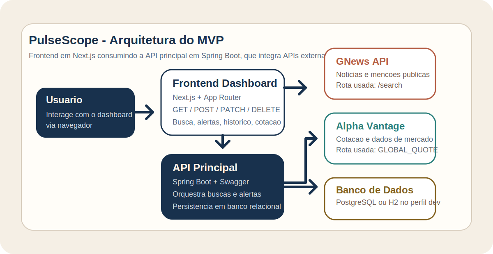

# Plataforma de Monitoramento Inteligente de Reputacao Digital

Sistema distribuido para coleta, analise e visualizacao de dados publicos com foco em reputacao de marcas e produtos.

## Cenário Escolhido

O projeto segue a ideia do cenario de dashboard integrado a servicos externos. Aqui, a interface consulta uma API principal que centraliza a logica do sistema, integra APIs externas publicas e persiste os dados localmente.

## Visao Geral

Esta aplicacao tem como objetivo monitorar mencoes publicas em fontes externas, processar essas informacoes por meio de analise de sentimento e gerar insights acionaveis via dashboard e alertas.

Neste repositorio existe apenas a API principal do sistema, implementada com Spring Boot. Ela atua como nucleo de orquestracao entre o front-end, a API externa e a API secundaria de analise.

## Objetivos

- Monitorar reputacao digital em tempo quase real
- Analisar sentimento de mencoes em positivo, neutro e negativo
- Detectar tendencias e variacoes de volume
- Gerar alertas automaticos por severidade
- Disponibilizar dados consolidados para dashboards

## Arquitetura

O sistema completo e composto por tres componentes principais:

1. Front-end Dashboard
   Responsavel pela interface de visualizacao, filtros, metricas e gestao de alertas.

2. API Principal Core
   Este repositorio. Responsavel por orquestrar buscas, integrar com servicos externos, persistir dados e expor a API central do sistema.

3. API Secundaria Engine de Analise
   Responsavel por classificar sentimento, calcular score de reputacao e identificar tendencias.

Existe ainda uma API externa publica para coleta de dados. O backend principal consome essa API, normaliza os dados recebidos e envia os textos para a API secundaria.

## Fluxograma da Arquitetura



## Fluxo do Sistema

1. O usuario realiza uma busca no dashboard.
2. O front-end envia a requisicao para a API principal.
3. A API principal consulta uma API externa de dados publicos.
4. Os dados recebidos sao normalizados em mencoes.
5. A API principal envia os textos para a API secundaria de analise.
6. A API secundaria retorna sentimento, score e indicadores.
7. A API principal persiste os resultados no PostgreSQL.
8. O dashboard consome os dados consolidados para exibicao de insights e alertas.

## Funcionalidades Planejadas

- Busca por palavra-chave
- Persistencia do historico de buscas
- Listagem de mencoes com filtros e paginacao
- Registro de resultados de analise
- Geracao de alertas por severidade
- Exibicao de dados consolidados para dashboard

## Modelo de Dados

Principais entidades da API principal:

- `mentions`
- `analysis_results`
- `alerts`
- `search_history`

## Stack Tecnologica da API Principal

- Java 21
- Spring Boot 3
- Spring Web
- Spring Data JPA
- Spring Validation
- Spring Actuator
- Springdoc OpenAPI Swagger
- WebClient para integracoes HTTP
- PostgreSQL
- Maven

## Estrutura do Projeto

```text
src
  main
    java
      com.pulsescope.backend
        config
        controller
        domain
        dto
        repository
        service
        client
    resources
```

## Endpoints Iniciais

Os endpoints iniciais da API principal serao organizados em torno dos seguintes recursos:

- `POST /api/searches`
- `GET /api/searches`
- `GET /api/mentions`
- `GET /api/mentions/{id}`
- `GET /api/alerts`
- `PATCH /api/alerts/{id}/status`
- `DELETE /api/alerts/{id}`
- `GET /api/dashboard/summary`

## Configuracao Local

### Requisitos

- Java 21
- Maven 3.9+
- PostgreSQL

### Variaveis recomendadas

A aplicacao pode ser configurada por propriedades Spring ou variaveis de ambiente:

- `DB_URL`
- `DB_USERNAME`
- `DB_PASSWORD`
- `EXTERNAL_API_BASE_URL`
- `GNEWS_API_KEY`
- `ANALYSIS_API_BASE_URL`
 - `ALPHA_VANTAGE_API_KEY`

### Executar localmente

Para desenvolvimento local sem PostgreSQL, use o perfil `dev` com H2 em memoria:

```bash
mvn spring-boot:run -Dspring-boot.run.profiles=dev
```

Para executar com PostgreSQL:

```bash
mvn spring-boot:run
```

Para usar credenciais locais sem expor secrets no repositorio, exporte variaveis de ambiente antes da execucao.

Exemplo:

```bash
export GNEWS_API_KEY=sua_chave_aqui
mvn spring-boot:run
```

## Documentacao Swagger

Quando a aplicacao estiver em execucao, a documentacao podera ser acessada em:

```text
/swagger-ui.html
```

ou

```text
/swagger-ui/index.html
```

Atalhos uteis em ambiente local:

- `http://localhost:8080/`
- `http://localhost:8080/swagger-ui.html`
- `http://localhost:8080/h2-console` com perfil `dev`

## Docker

Cada componente do sistema deve possuir seu proprio `Dockerfile`. Neste repositorio, o backend Spring Boot tera um container proprio para execucao da API principal.

### Build e execucao do container

```bash
docker build -t pulsescope-backend .
docker run -p 8080:8080 pulsescope-backend
```

## API Externa

O projeto esta preparado para consumir a GNews API como fonte externa de noticias e mencoes publicas.

Links oficiais:

- https://docs.gnews.io/
- https://gnews.io/

Informacoes importantes:

- Tipo: API publica com plano gratuito
- Cadastro: necessario para obter chave de API
- Rota utilizada neste projeto: `GET /api/v4/search`
- Uso no sistema: coleta de noticias e mencoes por palavra-chave

Tambem ha integracao complementar com a Alpha Vantage para consulta de dados de mercado por ticker.

Links oficiais:

- https://www.alphavantage.co/documentation/
- https://www.alphavantage.co/

Informacoes importantes:

- Tipo: API publica com plano gratuito
- Cadastro: necessario para obter chave de API
- Rota utilizada neste projeto: `function=GLOBAL_QUOTE`
- Uso no sistema: consulta de preco, variacao e volume por ticker

## Requisitos Atendidos por Este Modulo

- API REST com mais de 4 rotas
- Metodos HTTP `GET`, `POST`, `PATCH` e `DELETE`
- Documentacao Swagger
- Persistencia local com PostgreSQL ou H2 no perfil `dev`
- Dockerfile na raiz do repositorio
- Integracao com APIs externas sem redirecionar o usuario para outra aplicacao

## Proximos Passos

- Implementar a integracao real com a API externa escolhida
- Implementar a integracao real com a API secundaria de analise
- Adicionar filtros avancados, paginacao e ordenacao
- Criar `docker-compose.yml`, se necessario
- Adicionar testes de integracao
